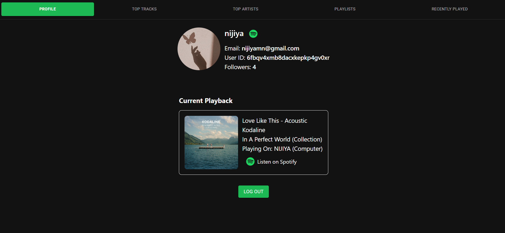
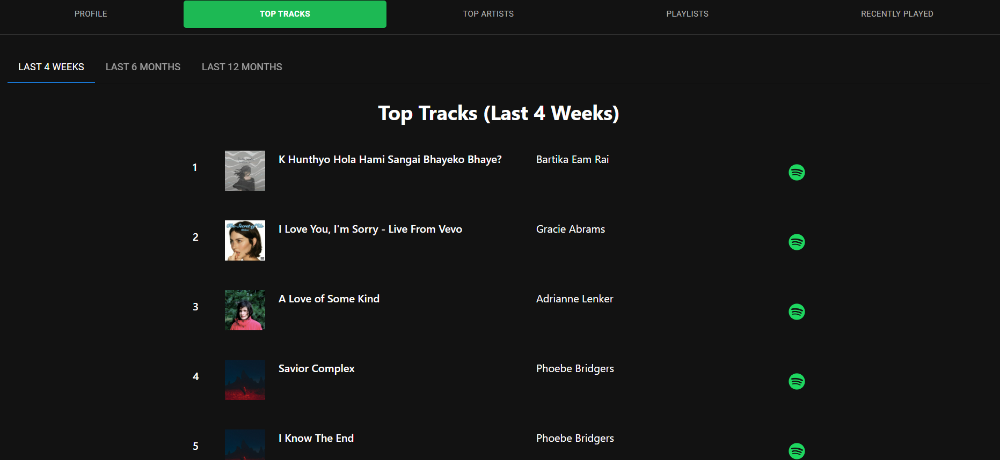
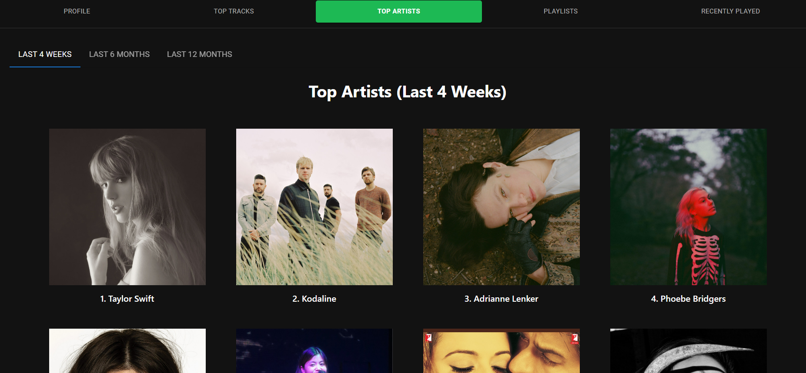
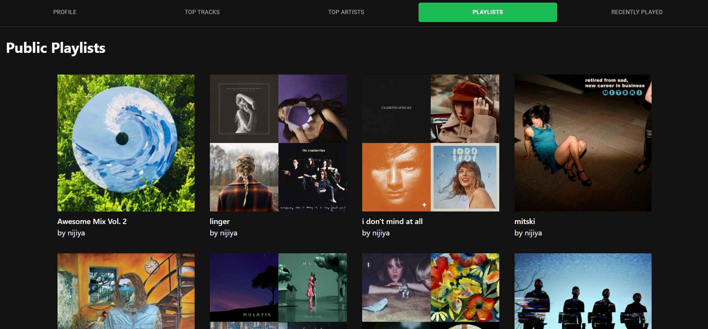
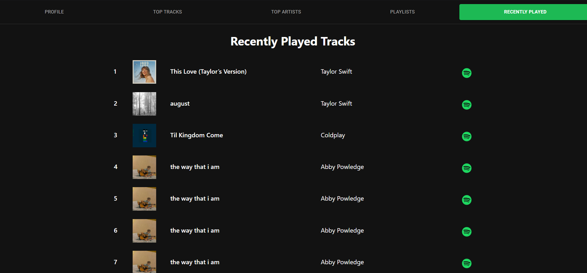

# Muse for Spotify

Muse for Spotify is a React-based application that integrates with Spotify’s Web API to provide information about a Spotify user's profile. The application includes various components such as profile details, top tracks, top artists, playlists, and currently playing music. With real-time playback tracking and detailed user insights, Muse offers a complete Spotify experience in a modern, responsive interface.

## Features
- **User Profile**: Displays user information such as name, email, followers, and profile picture.
- **Top Tracks**: Shows the user’s top tracks based on listening history.
- **Top Artists**: Displays the top artists the user has listened to.
- **Playlists**: Shows the user’s playlists.
- **Recently Played**: Displays the user's recently played tracks.
- **Current Playback**: Tracks and displays the currently playing track, artist, album, and device.
- **Authentication**: User authentication via Spotify’s OAuth 2.0 flow.

## Screenshots
Here are some screenshots showcasing the app’s UI:

### User Profile:

### Top Tracks:

### Top Artists:

### Playlists:

### Recently Played:

